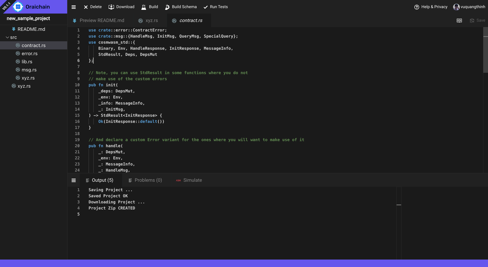
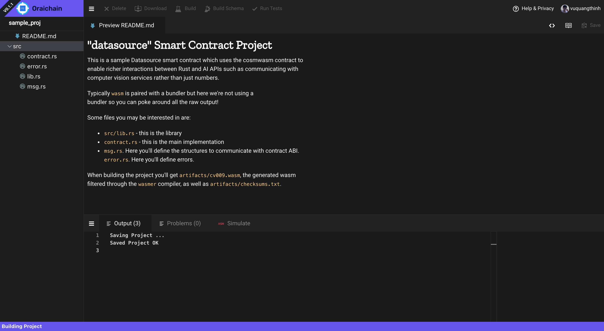

LOGIN
=========================

Click Connect để đăng nhập bằng github

Sau khi đăng nhập thành công, user có thể click vào project đã tạo từ trước / tạo mới project dựa trên template có sẵn.

OPEN / CREATE A PROJECT
=========================

VD: Tạo 1 datasource contract.

Tên của contract mới tạo không được trùng với các dự án đã tạo từ trước.
Tên chỉ chứa ký tự a-z0-9, không chứa ký tự đặc biệt hoặc dấu cách

Sau khi nhập tên, Click Create để tạo mới

IDE
=========================

Màn hình IDE bao gồm:
- treeview bên trái:
  - các file rust: Sourcecode của smart contract
  - artifact: json schema và wasm file
- editor:
  - toolbar:
    - download: tải toàn bộ sourcecode về máy tính
    - build: dịch smartcontract ra wasm file
    - build schema: sinh file json schema
    - run tests: chạy mã kiểm thử

### Thao tác với IDE

Click item file rust bên trái để edit:

Click phải vào 1 file để đổi tên / xoá / tải file về máy tính

Để build source code ra wasm click Build button tại thanh toolbar

Để build schema, click Build Schema tại thanh toolbar
Sau khi build schema thành công, 

### Simulate

### Deploy contract

Click chuột phải vào file wasm, chọn Deploy Contract
Màn hình mở ra trang keystation để thực hiện ký và deploy contract

